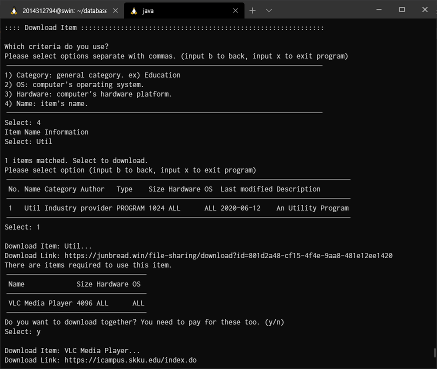

# Term Project: Market Place for File Sharing

2014312794 김준현

## Schema

### ER Diagram

    Since of the limitation of the tool, I could not draw double lined diagonal. I replaced to the shadowed one.


## Entity & Relationship

### User

Main entity of this project. The user including `user(subscriber)` and `provider` described in the requirement document. It is distinguished by `role` attribute.

It has no dependency to any entities.

### Item

Another main entity of this project. The user who's role is `provider` can `upload` multiple items, and `subscriber` can `download` multiple items. Because the user table is not strictly normalized, there are two relations between item and user.

- `Upload`: provider can upload items.
- `Download`: subscriber can download items.
- `Dependency`: the item may has multiple dependencies to other items.
- `Category`: the item has to be one of the category.

### Payment

This entity can be created at many situation. When provider first join to the system, joining fee payment is created. And when subscriber download the item, two payment to uploader(author) and downloader are created. Last, when user's subscription is activated, the payment for monthly subscription fee is also created.

The payments are initially unassigned to the bill(invoice). When monthly payment due date, the bill is created to all activated(subcribed) user. after the process, all unassigned payments are assigned to the each bill.

- `Occur`: The user can occur payment.
- `Assigned`: The payment can assigned to the bill. As above, it is optional.

### Bill

The monthly issued invoice entity. It is created based on pending payments information. It has to have exact one user dependency.

## DDL

### Table

#### USERS

```sql
create table users
(
	id varchar(20) not null,
	pw char(40) not null,
	name varchar(20) not null,
	role enum('SUBSCRIBER', 'PROVIDER', 'ADMIN') default 'SUBSCRIBER' not null,
	account_number varchar(20) not null,
	address varchar(100) null,
	phone varchar(13) null,
	birthday date null,
	join_date date default current_timestamp() not null,
	subscription tinyint(1) default 0 not null,
	last_login_time timestamp null,
	primary key (id)
);
```

##### TRIGGER: USERS_INSERT_JOINING_FEE_TRIGGER

This trigger fires when the provider joined and logged in first time. It creates a payment record with amount of joining fee which is stored in `constant` table.

```sql
create trigger users_insert_joining_fee_trigger
    after update
    on users
    for each row
begin
    declare joining_fee bigint(20) default 0;

    if new.role = 'PROVIDER' and old.last_login_time is null and new.last_login_time is not null then
        select value into joining_fee from constants where id = 'joining_fee';
        insert into payments (user_id, type, amount, due_date, comment)
        values (new.id, 'PAYMENT', joining_fee, adddate(last_day(curdate()), 1), 'JOINING');
    end if;
end;
```

#### ITEMS

```sql
create table items
(
	id int auto_increment
		primary key,
	author_id varchar(20) not null,
	category_id int not null,
	type enum('PROGRAM', 'IMAGE', 'VIDEO', 'AUDIO', 'DOCUMENT') not null,
	name varchar(100) not null,
	size int not null,
	url varchar(200) not null,
	update_time timestamp default current_timestamp() not null,
	hardware enum('MAC', 'PC', 'WORKSTATION', 'ALL') default 'ALL' null,
	os enum('MAC', 'WINDOWS', 'LINUX', 'ALL') default 'ALL' null,
	description varchar(1000) null,
	deleted tinyint(1) default 0 not null,
	constraint items_categories_id_fk
		foreign key (category_id) references categories (id),
	constraint items_users_id_fk
		foreign key (author_id) references users (id)
			on update cascade on delete cascade
);
```

##### TRIGGER: ITEMS_UPDATE_TIME_TRIGGER

This trigger changes last updated time when author modifies their item.

```sql
create trigger items_update_time_trigger
    before update
    on items
    for each row
begin
    if old.deleted = new.deleted then
        set new.update_time = current_timestamp();
    end if;
end;
```

#### CATEGORIES

```sql
create table categories
(
	id int auto_increment
		primary key,
	name varchar(20) not null
);
```

#### DEPENDENCIES

Relation between items. Note that the item can have multiple dependencies.

```sql
create table dependencies
(
	id int auto_increment
		primary key,
	item_id int not null,
	require_item_id int not null,
	constraint dependencies_items_id_fk
		foreign key (item_id) references items (id)
			on update cascade on delete cascade,
	constraint dependencies_items_id_fk2
		foreign key (require_item_id) references items (id)
			on update cascade on delete cascade
);
```

#### DOWNLOADS

Relation between items and users (subscribers). If item or user is deleted, this entity will be also deleted.

```sql
create table downloads
(
	id int auto_increment
		primary key,
	user_id varchar(20) not null,
	item_id int not null,
	download_time timestamp default current_timestamp() not null,
	constraint downloads_items_id_fk
		foreign key (item_id) references items (id)
			on update cascade,
	constraint downloads_users_id_fk
		foreign key (user_id) references users (id)
			on update cascade on delete cascade
);
```

##### TRIGGER: DOWNLOADS_INSERT_PAYMENT_TRIGGER

This trigger creates tweo payment entites, one for downloader and another one for uploader(author). When download entity is inserted, appropriate amount of download fee is added. The rate is depends on `constant` table.

```sql
create downloads_insert_payment_trigger
    after insert
    on downloads
    for each row
begin
    declare item_size int(11) default 0;
    declare download_rate bigint(20) default 0;
    declare uploader_id varchar(20) default NULL;
    begin
        select value into download_rate from constants where id = 'download_rate';
        select size, author_id into item_size, uploader_id from items where id = new.item_id;

        insert into payments (user_id, type, amount, due_date, comment)
        values (new.user_id,
                'PAYMENT',
                item_size * download_rate,
                adddate(last_day(curdate()), 1),
                'DOWNLOAD');
        insert into payments (user_id, type, amount, due_date, comment)
        values (uploader_id,
                'INCOME',
                item_size * download_rate,
                adddate(last_day(curdate()), 1),
                'DOWNLOAD');
    end;
end;
```

#### PAYMENTS

```sql
create table payments
(
	id int auto_increment
		primary key,
	user_id varchar(20) not null,
	type enum('INCOME', 'PAYMENT') default 'PAYMENT' not null,
	amount bigint not null,
	due_date date not null,
	comment varchar(20) null,
	issue_bill_id int null,
	constraint payments_bills_id_fk
		foreign key (issue_bill_id) references bills (id)
			on update cascade,
	constraint payments_users_id_fk
		foreign key (user_id) references users (id)
			on update cascade on delete cascade
);
```

#### BILLS

```sql
create table bills
(
	id int auto_increment
		primary key,
	user_id varchar(20) not null,
	issue_date timestamp default current_timestamp() null,
	income bigint default 0 not null,
	payment bigint default 0 not null,
	status enum('PENDING', 'FINISHED') default 'PENDING' not null,
	constraint bills_users_id_fk
		foreign key (user_id) references users (id)
			on update cascade on delete cascade
);
```

#### CONSTANTS

This is not a main entity table, but is important to run the application. It stores some important constants, which are download rate, upload rate, joining fee, subscription fee, etc. Please create these values with included sql file.

```sql
create table constants
(
	id varchar(20) not null,
	value bigint not null,
	primary key (id)
);
```

### View

The views are designed to simplify application embedded sql query. It is not as important as other elements. But you still need to create these.

#### DEPENDENCIES_EXT

```sql
create view dependencies_ext as
select `d`.`item_id`  AS `item_id`,
       `i`.`id`       AS `require_item_id`,
       `i`.`name`     AS `require_item_name`,
       `i`.`size`     AS `require_item_size`,
       `i`.`hardware` AS `require_item_hardware`,
       `i`.`os`       AS `require_item_os`,
       `i`.`url`      AS `require_item_url`
from (`project`.`dependencies` `d`
         join `project`.`items` `i` on (`d`.`require_item_id` = `i`.`id`));
```

#### DOWNLOADS_EXT

```sql
create view downloads_ext as
select `d`.`id`            AS `id`,
       `u`.`id`            AS `user_id`,
       `u`.`name`          AS `user_name`,
       `i`.`id`            AS `item_id`,
       `i`.`name`          AS `item_name`,
       `d`.`download_time` AS `download_time`
from ((`project`.`downloads` `d` join `project`.`users` `u` on (`d`.`user_id` = `u`.`id`))
         join `project`.`items` `i` on (`d`.`item_id` = `i`.`id`));
```

#### ITEMS_EXT

```sql
create view items_ext as
select `i`.`id`                                                                                      AS `id`,
       `i`.`type`                                                                                    AS `type`,
       `i`.`name`                                                                                    AS `name`,
       `i`.`size`                                                                                    AS `size`,
       `i`.`url`                                                                                     AS `url`,
       `i`.`update_time`                                                                             AS `update_time`,
       `i`.`hardware`                                                                                AS `hardware`,
       `i`.`os`                                                                                      AS `os`,
       `i`.`description`                                                                             AS `description`,
       (select count(0) from `project`.`downloads` where `project`.`downloads`.`item_id` = `i`.`id`) AS `download_cnt`,
       `c`.`id`                                                                                      AS `category_id`,
       `c`.`name`                                                                                    AS `category_name`,
       `u`.`id`                                                                                      AS `author_id`,
       `u`.`name`                                                                                    AS `author_name`,
       `i`.`deleted`                                                                                 AS `deleted`
from ((`project`.`items` `i` join `project`.`categories` `c` on (`i`.`category_id` = `c`.`id`))
         join `project`.`users` `u` on (`i`.`author_id` = `u`.`id`));
```

#### PROVIDERS_STAT

This query calculates total download count of each items uploaded by providers. the results are grouped by user id, so you can easilly found who is the the most popular uploader or not.

```sql
create view providers_stat as
select `items_ext`.`author_id`                                                                 AS `user_id`,
       `items_ext`.`author_name`                                                               AS `user_name`,
       ifnull(sum(`items_ext`.`download_cnt`) over ( partition by `items_ext`.`author_id`), 0) AS `user_download_cnt`,
       `items_ext`.`id`                                                                        AS `item_id`,
       `items_ext`.`name`                                                                      AS `item_name`,
       `items_ext`.`download_cnt`                                                              AS `item_download_cnt`
from `project`.`items_ext`;
```

#### SUBSCRIBERTS_STAT

This query calculates total download count of each items occured by users. the results are grouped by user id, so you can easilly found who is the the most active downloader or not.

```sql
create or replace view subscribers_stat as
select `u`.`id`                                        AS `user_id`,
       `u`.`name`                                      AS `user_name`,
       sum(d.download_cnt) over (partition by user_id) AS `user_download_cnt`,
       `d`.`item_id`                                   AS `item_id`,
       `d`.`item_name`                                 AS `item_name`,
       `d`.`download_cnt`                              AS `item_download_cnt`
from (`project`.`users` `u`
         join (select `downloads_ext`.`user_id`   AS `user_id`,
                      `downloads_ext`.`item_id`   AS `item_id`,
                      `downloads_ext`.`item_name` AS `item_name`,
                      count(0)                    AS `download_cnt`
               from `project`.`downloads_ext`
               group by `downloads_ext`.`user_id`, `downloads_ext`.`item_id`) `d`
              on (`u`.`id` = `d`.`user_id`))
where u.role = 'SUBSCRIBER';
```

### Procedure

The procedure will be run monthly by event scheduler. It is seperated because of the readability.

#### CREATE_SUBSCRIPTION_PAY_PROCEDURE

Creates subscription payment to every users who is activated subscription. The subscription fee is fixed when user is subscriber, and variable when user is provider. The detailed rate is stored in `constant` table.

```sql
create procedure create_subscription_pay_procedure()
begin
    declare subscription_fee bigint default 0;
    declare upload_rate bigint default 0;
    select value into subscription_fee from constants where id = 'subscription';
    select value into upload_rate from constants where id = 'upload_rate';

    /* Providers */
    insert into payments (user_id, type, amount, due_date, comment)
    select author_id,
           'PAYMENT',
           sum(size) * upload_rate,
           adddate(last_day(curdate()), 1),
           'SUBSCRIPTION'
    from items
    group by author_id;

    /* Subscribers */
    insert into payments (user_id, type, amount, due_date, comment)
    select id,
           'PAYMENT',
           subscription_fee,
           adddate(last_day(curdate()), 1),
           'SUBSCRIPTION'
    from users
    where role = 'SUBSCRIBER'
      and subscription = true;
end;
```

#### DELETE_UNUSED_ITEMS_PROCEDURE

If uploaded items' download count is under the delete threshold, those items are be deleted. But not "physically" deleted. It will indicates deleted item, but still remained in the database. This is because the item statistics will be kept.

```sql
create procedure delete_unused_items_procedure()
begin
    declare threshold bigint default 0;
    select value into threshold from constants where id = 'delete_threshold';

    update items
    set deleted = true
    where deleted = false
      and (select count(*)
           from downloads
           where item_id = id
             and month(download_time) = (month(curdate()) - 1)
           group by item_id
          ) < threshold;
end;
```

#### ISSUE_BILLS_PROCEDURE

Issues monthly invoice(bill). The amount of the income and payments are, pending(not assigned to the specific bill) payments amount + remaining bill (unpaid previous month bill).

```sql
create procedure issue_bills_procedure()
begin
    declare update_date timestamp default current_timestamp();

    /* Issue new bills */
    insert into bills (user_id, issue_date, income, payment, status)
    select id,
           update_date,
           ifnull((select sum(amount)
                   from payments
                   where user_id = users.id
                     and issue_bill_id is null
                     and type = 'INCOME'), 0) +
           ifnull((select sum(income) from bills where user_id = users.id and status = 'PENDING'), 0),
           ifnull((select sum(amount)
                   from payments
                   where user_id = users.id
                     and issue_bill_id is null
                     and type = 'PAYMENT'), 0) +
           ifnull((select sum(payment) from bills where user_id = users.id and status = 'PENDING'), 0),
           'PENDING'
    from users;

    /* Expire old bills */
    update bills
    set status = 'FINISHED'
    where issue_date <> update_date;

    /* Update pending payments */
    update payments
    set issue_bill_id = (select id from bills where user_id = payments.user_id and status = 'PENDING')
    where issue_bill_id is null;
end;
```

### Event

#### UPDATE_DATABASE_INFORMATIONS

To fire above procedures monthly, event scheduler is needed. This statement creates event scheduler starts with first day of next month.

```sql
create event update_database_informations on schedule
    every '1' MONTH
        starts adddate(prev_day(curdate()), 1)
    enable
    do
    begin
        call create_subscription_pay_procedure();
        call delete_unused_items_procedure();
        call issue_bills_procedure();
    end;
```

## DML

This SQL syntax is not valid as-is, because this code snippets are part of embedded SQL execution using JDBC and some library. So, please use only for reference.

Most of DML statements are executed on service layer. If you want to see actual query flow, see service package.

### UserService

```java
String sql = "SELECT * FROM users WHERE id = :id";
```

```java
String sql = "UPDATE users SET name = :name, account_number = :accountNumber, address = :address, phone = :phone, birthday = :birthday, subscription = :subscription WHERE id = :id";
```

```java
String sql = "DELETE FROM user WHERE id = :id";
```

### SecurityService

```java
String sql = "INSERT INTO users" +
                " (id, name, role, address, phone, birthday, subscription, account_number, pw)" +
                " VALUES (:id, :name, :role, :address, :phone, :birthday, :subscription, :accountNumber, SHA1(:pw))";
```

```java
String sql = "SELECT (SELECT id FROM users WHERE id = :id) IS NOT NULL";
```

```java
String sql = "SELECT IFNULL((SELECT pw FROM users WHERE id = :id) = SHA1(:pw), false)";
```

```java
String sql = "UPDATE users SET last_login_time = CURRENT_TIMESTAMP() WHERE id = :id";
```

### ItemService

```java
String sql = "SELECT * FROM items_ext WHERE id = :id";
```

This statement is dynamic, which used to search the items with given criteria.
```java
    public static List<Item> getItems(Map<String, Object> criteria) {
        StringBuilder sqlBuilder = new StringBuilder("SELECT * FROM items_ext WHERE 1=1");
        criteria.forEach((key, value) -> {
            if (key.equals("name"))
                sqlBuilder.append(" AND " + key + " LIKE CONCAT('%',:" + key + ",'%')");
            else
                sqlBuilder.append(" AND " + key + " = :" + key);
        });
        sqlBuilder.append(" AND deleted = false");

        return DataSource.getConnection().withHandle(handle ->
                handle.createQuery(sqlBuilder.toString())
                        .bindMap(criteria)
                        .map(new ItemMapper())
                        .list());
    }
```

```java
String sql = "SELECT * FROM dependencies_ext WHERE item_id = :item_id";
```

```java
String sql = "INSERT INTO downloads (user_id, item_id) VALUES (:user_id, :item_id)";
```

```java
String insertSql = "INSERT INTO items" +
        " (author_id, type, name, category_id, size, url, hardware, os, description)" +
        " VALUES(:author.id, :type, :name, :category.id, :size, :url, :hardware, :os, :description)";

String dependencySql = "INSERT INTO dependencies (item_id, require_item_id) values (:item_id, :require_item_id)";
```

```java
String sql = "UPDATE items SET" +
        " name = :name, category_id = :category.id, size = :size, hardware = :hardware," +
        " os = :os, description = :description" +
        " WHERE id = :id";
```

```java
String sql = "UPDATE items SET deleted = true WHERE id=:id";
```

### CategoryService

```java
String sql = "SELECT ~* FROM categories";
```

### PaymentService

```java
String sql = "SELECT * FROM bills WHERE user_id = :id ORDER BY issue_date DESC LIMIT 1";
```

```java
String sql = "UPDATE bills SET status = 'FINISHED' WHERE user_id = :id AND status = 'PENDING'";
```

### StatService

```java
String sql = "SELECT * FROM downloads_ext WHERE item_id = :id";
```

```java
String sql = "SELECT * FROM providers_stat ORDER BY user_download_cnt " + (asc ? "ASC" : "DESC") + " LIMIT :threshold";
```

```java
String sql = "SELECT * FROM subscribers_stat ORDER BY user_download_cnt " + (asc ? "ASC" : "DESC") + " LIMIT :threshold";
```

```java
String sql = "SELECT * FROM items_ext ORDER BY download_cnt " + (asc ? "ASC" : "DESC") + " LIMIT :threshold";
```

## How to Build & Run

### Requirements

**Due to Incompatibility between MariaDB and MySQL, you *MUST* run it on MariaDB. Sorry.**

- Maven
- Java >= 1.8
- MariaDB >= 10.4.13

### Database Procedure

run SQL script in `src/main/resources/database.sql`. This script creates everything to run the project.

After that, you need to change the database configuration. change `src/main/resources/database.properties` file's content to valid user, password and database name. Default is `root@localhost:3306`.

### Build & Run Procedure

- Go to project source root.
- Type `mvn package`. Maven will download dependencies automatically, and will create `jar` executable file.
- Go to `target` directory.
- Run `java -jar project.jar`.

## User Manual

This project is text-based program, so please run it in terminal.

Basically you can input numbers (or alphabet) to select options, or exit menu.

### Login & Register

This is welcome menu. you can login or register.


If you have entered valid id/pw, you can login to the system.

### ADMIN

The main menu has different options depends on your role status. If you are ADMIN, you can see below menu. Note that the admin account cannot be registered by the program, it has to be directly inserted to the database.


Admin has three main menu, which is subscriber statistics, provider statistics, and item statistics. Admin can remove provider/item entries which are not accessed many. That function is submenu of each statistics menu.


First, in the subscriber statistics menu, you can see the top 3 highest access users, and 3 lowest access users, and their accessed item informations. (Note that in this screenshot the number of entries are very few, so highest and lowest users are almost same.) Subscribers cannot be deleted.


Next is provider statistics. It is almost same as subscribers statistics, but you can purge the providers which has low accessed items.


Last, you can also view the statistics of items. You can also delete the low-accessed items.

### SUBSCRIBER


Subscriber is exactly fit to `user` described in requirement document. It has 2 main menus, which is `finance` and `item`.


The `finance` menu is including two features, view payments information and subscriptions.


You can view monthly bill information, and also do payment. Bills are automatically renewed monthly including the pending payments, and remaining bills which are not paid yet.


You can pay for the subscription. the payment is simulated.


Another main feature is searching/downloading items. You can search items with multiple criteria, which separated with commas.


In this example, we choose 4(Name) and keyword of `Util`. If matched items are exist, the informations are listed. Choose number to download.



If the file needs some another items to use it, a prompt will be automatically popped up. You can choose to download or not. The program is also counted as regular download, so you have to pay.

### PROVIDER

Provider has almost same functionality to subscriber, especially in `finance` section. Provider also can view pending bill, and toggle the subscription. But the amount of subscription fee is different, which is `upload rate * uploaded file size`.

But `item` section is different. Providers can upload/update/delete their own item.


Above is upload procedure. You cannot directly insert category. Only provided category can be selected. If you have dependency, You can also search for it.


After upload the item, you can manage your item status. Select item index to do with the item. Providers can view each items' download logs, modify item, and delete item.


Above is viewing item download log.


Above is updating the item information. You can see the description is changed to `Wow Wow Wow`.


Above is deleting the item. To keep the statistics, when user deletes an item, the item is only marked as deleted, and not actually removed from the database. Regular users cannot search or download anymore, but DBA or admin can see statistics such as download count, etc.
